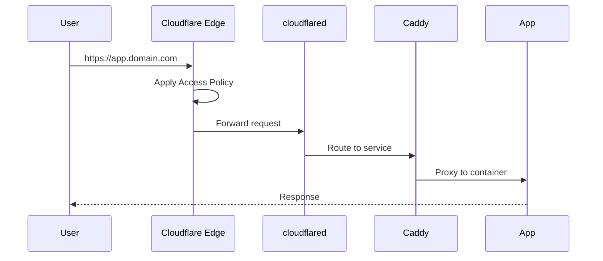

## Overview

Cloudflare Tunnel (cloudflared) provides secure access to internal services without opening any ports on the router. All traffic is routed through Cloudflare's network.

<Info>
No port forwarding required. The tunnel creates an outbound connection to Cloudflare, which then routes incoming requests to your services.
</Info>

## How It Works



## Architecture

| Component | Location | Role |
|-----------|----------|------|
| Cloudflare Access | Cloudflare Edge | Authentication policies |
| cloudflared | Podman container on CoreOS | Tunnel daemon |
| Caddy | Podman container on CoreOS | Reverse proxy |

## Deployment

The `cloudflared` container runs as a Podman Quadlet on Fedora CoreOS.

### Quadlet Configuration

```ini
# /etc/containers/systemd/cloudflared.container
[Container]
Image=docker.io/cloudflare/cloudflared:latest
Exec=tunnel run
Environment=TUNNEL_TOKEN=<token-from-cloudflare>
Network=host

[Service]
Restart=always

[Install]
WantedBy=multi-user.target
```

<Warning>
Store the tunnel token securely. Consider using a secrets manager or environment file with restricted permissions.
</Warning>

## Terraform Configuration

The tunnel is managed via Terraform:

```hcl
resource "cloudflare_tunnel" "homelab" {
  account_id = var.cloudflare_account_id
  name       = "homelab"
  secret     = var.tunnel_secret
}

resource "cloudflare_tunnel_config" "homelab" {
  account_id = var.cloudflare_account_id
  tunnel_id  = cloudflare_tunnel.homelab.id

  config {
    ingress_rule {
      hostname = "*.domain.com"
      service  = "http://caddy:80"
    }
    ingress_rule {
      service = "http_status:404"
    }
  }
}
```

## Integration with Cloudflare Access

All services behind the tunnel are protected by Cloudflare Access policies, which authenticate users via Authentik (OIDC).

See [Authentication](/overview/authentication) for the full auth flow.

## Troubleshooting

<Accordion title="Tunnel not connecting">
Check the container logs:
```bash
podman logs cloudflared
```

Common issues:
- Invalid or expired tunnel token
- Network connectivity issues
- DNS resolution problems
</Accordion>

<Accordion title="502 Bad Gateway">
The tunnel is working but can't reach the backend:
- Verify Caddy is running: `systemctl status caddy`
- Check the service URL in tunnel config matches Caddy's listener
- Ensure containers are on the same network
</Accordion>
