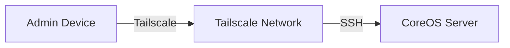

## Overview

Tailscale provides secure remote access for administration tasks. It's used exclusively for SSH access to the server—not for accessing services (which go through Cloudflare Tunnel).

<Info>
Tailscale creates a private mesh network. No ports need to be opened, and connections are end-to-end encrypted.
</Info>

## Use Case



| Use | Method |
|-----|--------|
| Access services | Cloudflare Tunnel |
| SSH to server | Tailscale |
| Emergency access | Tailscale |

## Installation on Fedora CoreOS

Tailscale is installed directly on the host (not containerized) for full network access.

### Ignition Configuration

```json
{
  "ignition": { "version": "3.4.0" },
  "systemd": {
    "units": [
      {
        "name": "tailscaled.service",
        "enabled": true
      }
    ]
  }
}
```

### Manual Setup

```bash
# Install Tailscale
curl -fsSL https://tailscale.com/install.sh | sh

# Authenticate
sudo tailscale up

# Verify connection
tailscale status
```

## Terraform Configuration

Tailscale ACLs and device authorization are managed via Terraform:

```hcl
resource "tailscale_acl" "homelab" {
  acl = jsonencode({
    acls = [
      {
        action = "accept"
        src    = ["tag:admin"]
        dst    = ["tag:server:22"]
      }
    ]
    tagOwners = {
      "tag:admin"  = ["autogroup:owner"]
      "tag:server" = ["autogroup:owner"]
    }
  })
}
```

## Authentication

Tailscale is configured to authenticate via an OAuth provider (GitHub, Google, etc.). This keeps authentication simple and separate from the Authentik setup used for services.

## Security Considerations

<Columns cols={2}>
  <Card title="SSH Only" icon="terminal">
    Tailscale is only used for SSH access. Services are accessed via Cloudflare Tunnel with proper authentication.
  </Card>
  <Card title="ACL Restricted" icon="shield">
    Tailscale ACLs limit which devices can reach which ports. Only admin-tagged devices can SSH.
  </Card>
</Columns>

## Troubleshooting

<Accordion title="Can't connect to server">
Check Tailscale status on the server:
```bash
tailscale status
```

Verify:
- Server is online in Tailscale admin console
- ACLs allow your device to reach the server
- SSH service is running: `systemctl status sshd`
</Accordion>

<Accordion title="Authentication issues">
Re-authenticate if the session expired:
```bash
sudo tailscale up --reset
```
</Accordion>
