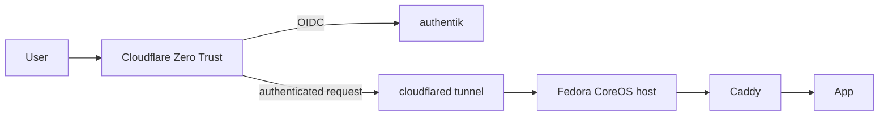

# Architecture

## Request flow

```mermaid
flowchart LR
  U[User] --> CF[Cloudflare Zero Trust]
  CF -->|OIDC| AK[authentik]
  CF -->|authenticated request| T[cloudflared tunnel]
  T --> FC[Fedora CoreOS host]
  FC --> CY[Caddy]
  CY --> APP[App]
```
