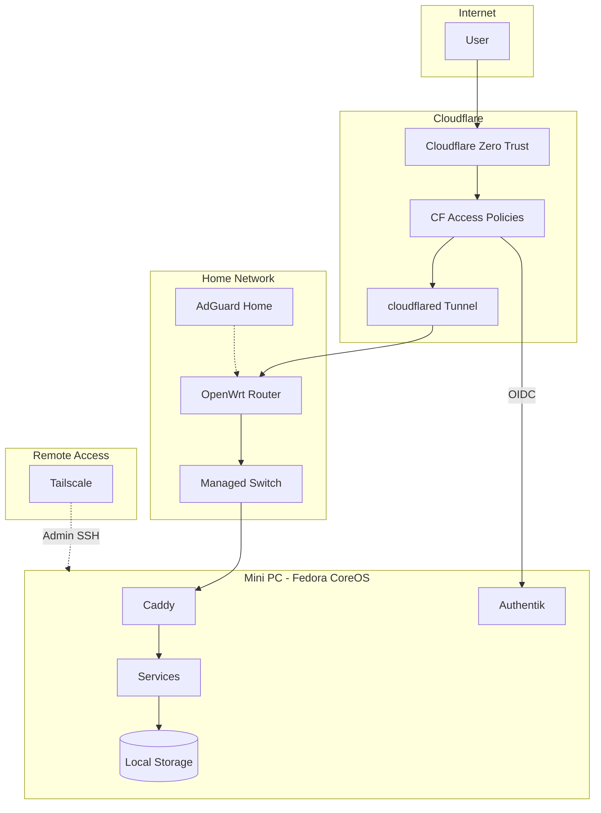
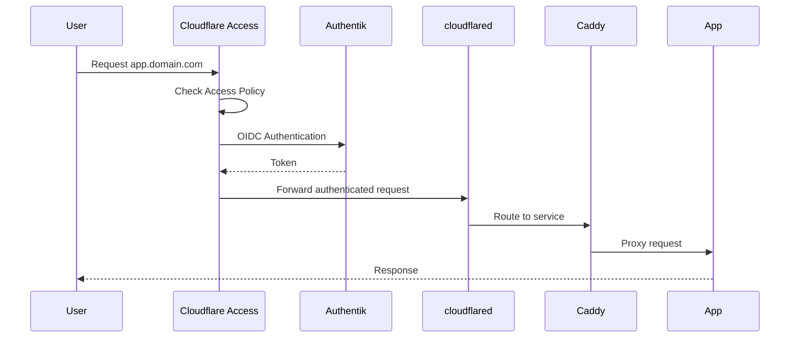

## Overview

This homelab runs on a single Mini PC with Fedora CoreOS, using Podman Quadlets for containerized services. All external access goes through Cloudflare Zero Trust, with Authentik providing SSO for applications.

## Infrastructure Diagram



## Request Flow

### External Access (Public Services)



### Admin Access (Tailscale)

Tailscale provides secure SSH access for administration without exposing ports to the internet.

```
Admin Device → Tailscale → Mini PC (SSH)
```

## Core Components

<Columns cols={2}>
  <Card title="Fedora CoreOS" icon="server">
    Immutable OS with automatic updates. Containers managed via Podman Quadlets (systemd units).
  </Card>
  <Card title="Cloudflare Zero Trust" icon="shield">
    Tunnel for ingress, Access policies for authentication. No open ports on the router.
  </Card>
  <Card title="Authentik" icon="key">
    SSO provider. Apps authenticate via OIDC/SAML. Integrated with Cloudflare Access.
  </Card>
  <Card title="Caddy" icon="arrows-split-up-and-left">
    Reverse proxy with automatic HTTPS. Routes traffic to containers.
  </Card>
  <Card title="OpenWrt + AdGuard" icon="router">
    Router with managed switch for network control. AdGuard Home for DNS and ad-blocking.
  </Card>
  <Card title="Tailscale" icon="lock">
    Mesh VPN for admin access. SSH into server without exposing ports.
  </Card>
</Columns>

## Infrastructure as Code

| Component | Tool | Description |
|-----------|------|-------------|
| Cloudflare | Terraform | Tunnel, DNS, Access policies |
| Tailscale | Terraform | ACLs, device authorization |
| Authentik | Terraform | Applications, providers, policies |
| Grafana | Terraform | Dashboards, data sources |
| CoreOS | Ignition | Initial provisioning |
| Containers | Git + SCP | Quadlet files deployed manually |

## Network (Current)

Currently running a flat network (no VLANs). Future plans may include segmentation for IoT devices.

| Device | Role |
|--------|------|
| OpenWrt Router | Main gateway, AdGuard Home DNS |
| Managed Switch | Connects all devices |
| Mini PC | Fedora CoreOS server |
